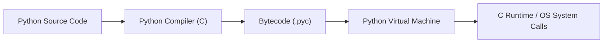
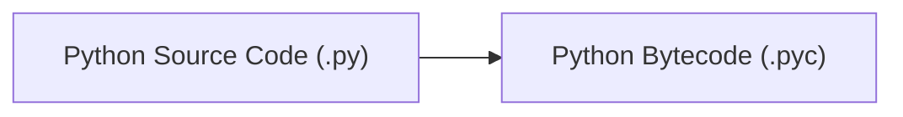
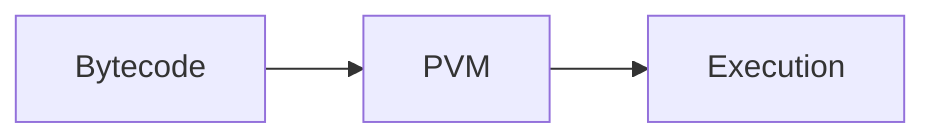
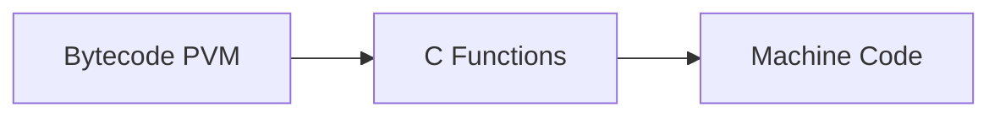
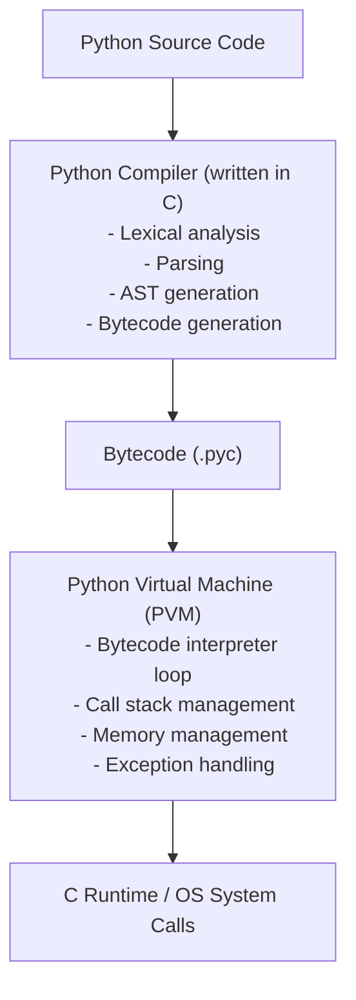
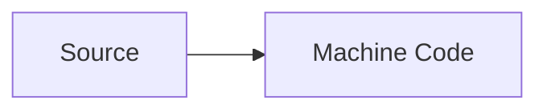
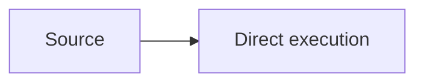
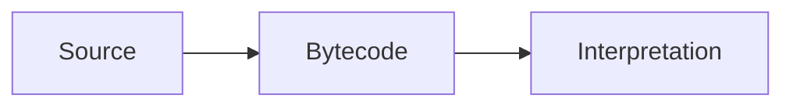

# Execution Model

## The Python Execution Pipeline

<div align="center">



</div>

### 1. Source Code (.py files)

You write Python code in text files with a `.py` extension:

```python
# This is human-readable source code
def greet(name):
    return f"Hello, {name}!"

print(greet("World"))
```

### 2. Compilation to Bytecode

When you run a Python file, the first step is compilation:

<div align="center">



</div>

**Bytecode** is an intermediate representation - lower-level than source code but higher-level than machine code. It's platform-independent and optimized for the Python Virtual Machine.

**Key points:**

- This compilation happens automatically and transparently
- Bytecode is cached in `__pycache__` directories to speed up subsequent runs
- The `.pyc` files contain bytecode for imported modules
- If the source hasn't changed, Python reuses the cached bytecode

=== "Source code"

    ```python
    import dis

    def add(x, y):
        return x + y

    dis.dis(add)
    ```

=== "Bytecode"

    ```bash
    # This shows the bytecode instructions: load variables, add them, return result
    2           0 LOAD_FAST                0 (x)
                2 LOAD_FAST                1 (y)
                4 BINARY_ADD
                6 RETURN_VALUE
    ```

### 3. Execution by the Python Virtual Machine (PVM)

The **Python Virtual Machine** (PVM) is the runtime engine that executes bytecode:

<div align="center">



</div>

The PVM is a loop that reads bytecode instructions one at a time and executes them. This is what makes Python _interpreted_ - there's a runtime system interpreting instructions rather than native machine code running directly on the CPU.

**The PVM:**

- Maintains the Python runtime environment
- Manages memory (heap, stack)
- Handles the call stack
- Executes bytecode instructions
- Interfaces with the underlying operating system

### 4. Native Code Execution (when needed)

Some operations drop down to native C code:

<div align="center">



</div>

This happens when:

- Calling built-in functions implemented in C
- Using extension modules written in C/C++
- Performing operations on built-in types (which are C implementations)

This is why operations on lists, dicts, and strings are fast despite Python being _interpreted._

## CPython: The Reference Implementation

**CPython** is the standard Python implementation written in C. When people say "Python," they usually mean CPython.

### Architecture

<div align="center">



</div>

### Why C?

CPython is implemented in C for:

- **Portability**: C compilers exist for virtually every platform
- **Performance**: Critical operations can be highly optimized
- **Integration**: Easy to interface with C libraries
- **Low-level control**: Direct memory management, system calls

## Compilation vs. Interpretation

Python is often called _interpreted_ but this is an oversimplification.

### What Happens

1. **Compile-time**: Source → Bytecode (compilation)
2. **Runtime**: Bytecode → Execution (interpretation)

Python is **compiled to bytecode**, then that bytecode is **interpreted by the PVM**.

### Comparison with Other Languages

**Fully compiled (C, C++, Rust):**

<div align="center">



</div>

**Interpreted (old scripting languages):**

<div align="center">



</div>

**Python, Java, C#:**

<div align="center">



</div>

This hybrid approach balances flexibility with performance.

## Dynamic Typing and Runtime Behavior

Python determines types at runtime, which affects execution:

### Type Checking Happens During Execution

```python
# The function doesn't declare types
# Python checks compatibility when executing the `+` operator
def add(a, b):
    return a + b

add(1, 2)               # Works: int + int
add("Hello", " World")  # Works: str + str
add(1, "two")           # TypeError at runtime
```

### Name Resolution is Dynamic

```python
x = 10

def use_x():
    return x + 5 # (1)!

print(use_x())  # 15

x = 20
print(use_x())  # 25 - different result, same function
```

1.  The function looks up `x` each time it runs. This flexibility comes with performance cost.

### Late Binding

Python resolves attribute access and method calls at runtime:

```python
class Dog:
    def speak(self):
        return "Woof"

class Cat:
    def speak(self):
        return "Meow"

def make_speak(animal):
    return animal.speak()  # Don't know what speak() does until runtime

make_speak(Dog())  # "Woof"
make_speak(Cat())  # "Meow"
# The method called depends on the runtime type of `animal`.
```

## The Global Interpreter Lock

**The GIL is a mutex that protects access to Python objects**, preventing multiple threads from executing Python bytecode simultaneously.

### Why the GIL Exists

CPython's memory management (reference counting) isn't thread-safe. The GIL is a pragmatic solution:

- Simple to implement
- Excellent single-threaded performance
- No fine-grained locking overhead

### Impact

**Threading limitations:**

```python
import threading

# CPU-bound work doesn't parallelize due to GIL
def count(n):
    for i in range(n):
        pass

threads = [threading.Thread(target=count, args=(10000000,)) for _ in range(4)]
# These threads won't run in parallel for CPU work
```

**I/O-bound work is fine:**

```python
import threading
import requests

def fetch(url):
    requests.get(url)  # Releases GIL during I/O

# These can run concurrently
threads = [threading.Thread(target=fetch, args=(url,)) for url in urls]
```

**Workarounds:**

- **Multiprocessing**: Separate processes bypass the GIL entirely
- **Async I/O**: Single-threaded concurrency for I/O-bound work
- **Native extensions**: C extensions can release the GIL for CPU work

## Memory Management

### Reference Counting

CPython tracks how many references exist to each object:

```python
import sys

x = []  # Reference count: 1
y = x   # Reference count: 2
sys.getrefcount(x)  # Returns 3 (2 + temporary ref from getrefcount)

# When an object's reference count reaches zero, it's immediately deallocated
```

### Garbage Collection

For circular references (which reference counting can't handle):

```python
class Node:
    def __init__(self):
        self.ref = None

a = Node()
b = Node()
a.ref = b
b.ref = a  # Circular reference

del a
del b
# Objects still exist due to circular refs
# Python's garbage collector runs periodically to detect and clean up cycles
```

### Memory Layout

Python objects have overhead:

```python
import sys

x = 1
sys.getsizeof(x)  # (2)!
# 28 bytes on 64-bit Python
# This overhead enables Python's flexibility but uses more memory than compiled languages
```

2.  Much more than a C int (4 bytes) due to:
    - Type information
    - Reference count
    - Additional bookkeeping

## Import System

### How Imports Work

```python
import module
```

1. **Search**: Look for `module.py` in `sys.path`
2. **Compile**: If `module.pyc` is outdated or missing, compile to bytecode
3. **Execute**: Run the module's code (top to bottom)
4. **Cache**: Store the module object in `sys.modules`
5. **Bind**: Assign the module object to the name `module` in current namespace

### Import is Execution

Importing a module executes its code:

=== "module.py"

    ```python
    # Modules are executed once per Python session
    print("Module imported!")

    x = 10
    ```

=== "main.py"

    ```python
    import module  # Prints "Module imported!"
    import module  # Doesn't print again - already cached
    ```

## The REPL

Python's interactive interpreter:

```bash
>>> x = 10      # Read input
>>> x + 5       # Evaluate expression
15              # Print result
>>>             # Loop back
```

The REPL:

1. **Reads** a line of input
2. **Evaluates** it (compiles to bytecode, executes)
3. **Prints** the result (if it's an expression)
4. **Loops** back

This immediate feedback makes Python excellent for exploration and debugging.

## Performance Implications

Understanding execution helps explain performance characteristics:

### Why Python is _Slow_

1. **Bytecode interpretation overhead**: Each bytecode instruction requires dispatch
2. **Dynamic typing**: Type checks at runtime
3. **Name resolution**: Looking up variables and attributes dynamically
4. **Object overhead**: Every value is a full Python object
5. **No JIT compilation**: Unlike Java/C# (though PyPy has JIT)

### When Python is Fast Enough

1. **I/O-bound operations**: Network, disk, database - Python overhead is negligible
2. **Calling optimized libraries**: NumPy, Pandas use C/Fortran underneath
3. **Coarse-grained operations**: Large batch operations amortize Python overhead
4. **Development speed matters more**: Code is written once, run many times

### Making Python Faster

- **Use built-in operations**: They're implemented in C
- **Vectorize with NumPy**: Avoid Python loops for numerical work
- **Profile first**: Optimize what actually matters
- **Use PyPy**: JIT-compiled Python for long-running programs
- **Write extensions**: Cython, C, Rust for critical hotspots

## Summary

Python's execution model is a carefully designed compromise:

- **Compilation to bytecode**: Faster than re-parsing source
- **Interpretation by PVM**: Flexibility and portability
- **Dynamic typing**: Expressiveness at the cost of performance
- **Reference counting + GC**: Automatic memory management
- **GIL**: Simplicity for single-threaded use, limitations for parallelism

Understanding this model helps you:

- Write code that works with Python's strengths
- Debug issues by understanding what's actually happening
- Make informed performance decisions
- Choose the right tools for the right problems

The execution model is a **means to Python's end**: enabling rapid development of readable, maintainable code.

## Next Steps

- Explore [Mental Models](mental-models.md) that build on this execution understanding
- See these concepts in action in [Fundamentals](../fundamentals/)
- Learn about optimization in [Performance and Optimization](../performance_and_optimization/)
