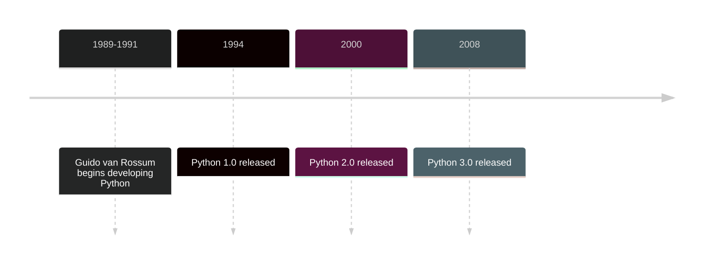

# Introduction to Python

## What is Python?

Python is a high-level, interpreted, general-purpose programming language created by Guido van Rossum and first released in 1991. It emphasizes code readability and programmer productivity through clean syntax and a comprehensive standard library.

**Key Characteristics:**

- **High-level**: Abstracts away low-level details like memory management
- **Interpreted**: Code is executed line-by-line by the Python interpreter
- **Dynamically typed**: Variable types are determined at runtime
- **Multi-paradigm**: Supports procedural, object-oriented, and functional programming
- **General-purpose**: Applicable to diverse domains from web development to data science

## A Brief History



## Why Learn Python?

### Readability and Simplicity

Python's syntax is designed to be readable and straightforward. It uses indentation for block structure, avoiding the visual noise of braces and semicolons found in many other languages. The code reads almost like pseudocode, reducing the cognitive load of understanding what the code does.

=== "Python"

    ``` python
    def calculate_average(numbers):
        return sum(numbers) / len(numbers)
    ```

=== "Java"

    ``` java
    public static double calculateAverage(double[] numbers) {

        double sum = 0.0;

        for (double num : numbers) {
            sum += num;
            }

        return sum / numbers.length;
    }
    ```

### Comprehensive Standard Library

Python's _batteries included_ philosophy means it comes with a rich standard library covering:

- File I/O and operating system interfaces
- Data structures and algorithms
- Internet protocols and data formats
- Testing frameworks and debugging tools
- And much more

This reduces the need for external dependencies for many common tasks.

### Versatility Across Domains

Python is genuinely general-purpose. It's used in:

- **Web development**: Django, Flask, FastAPI
- **Data science**: NumPy, Pandas, Matplotlib
- **Machine learning**: TensorFlow, PyTorch, scikit-learn
- **Automation and scripting**: os, sys, subprocess
- **Scientific computing**: SciPy, SymPy
- **Desktop applications**: Tkinter, PyQt
- **Game development**: Pygame
- **Testing and QA**: pytest, Selenium

Few languages offer this breadth while maintaining quality libraries in each domain.

### Strong Community and Ecosystem

- Massive collection of third-party packages on PyPI (Python Package Index)
- Extensive documentation and learning resources
- Active community support through forums, conferences, and local meetups
- Corporate backing from organizations like Google, Microsoft, and Meta

### Career Relevance

Python skills are highly valued across industries:

- Tech companies use it for backend services, data pipelines, and ML systems
- Financial institutions use it for quantitative analysis and risk modeling
- Scientific research relies on it for data analysis and simulation
- Startups choose it for rapid prototyping and MVP development

The language's versatility means Python skills transfer across different roles and domains.

## Python's Role in Software Engineering

### Rapid Prototyping

Python's concise syntax and dynamic nature make it excellent for:

- Quickly testing ideas and hypotheses
- Building proofs-of-concept
- Creating throwaway exploratory code
- Iterating on designs before committing to implementation

### Glue Language

Python excels at connecting different systems and technologies:

- Integrating with C/C++ libraries for performance-critical code
- Orchestrating complex workflows between different services
- Wrapping command-line tools with Python interfaces
- Bridging between different data formats and protocols

### Production Systems

Despite being interpreted, Python runs many large-scale production systems:

- Instagram's backend serves billions of users with a Python/Django stack
- Netflix uses Python extensively for their recommendation algorithms
- Dropbox's desktop client and backend infrastructure
- SpaceX uses Python for mission-critical systems

!!! info

    Modern Python with proper engineering practices (type hints, testing, profiling) is suitable for production use.

### Teaching and Learning

Python is often a first language because:

- Syntax doesn't get in the way of learning programming concepts
- Interactive interpreter enables immediate feedback
- Error messages are generally clear and helpful
- Gentle learning curve from basics to advanced topics

## What Makes Python Different?

**Philosophy Over Features**: Python prioritizes having _one obvious way_ to do things rather than multiple competing approaches. This creates consistency across codebases and reduces decision fatigue.

**Readability as a Core Value**: _Code is read much more often than it is written._ Python's design consistently favors readability over brevity or cleverness.

**Dynamic but Not Chaotic**: While dynamically typed, Python isn't _loose_ or unpredictable. The language has clear rules and emphasizes explicit over implicit behavior.

**Practical Over Pure**: Python is pragmatic - it borrows good ideas from multiple paradigms without dogmatically adhering to any single approach. It's OOP, but you don't need classes for everything. It supports functional programming, but doesn't force immutability.

## Understanding Python's Position

### It's Not the Fastest

Python trades raw execution speed for development speed. For most applications, programmer time is more expensive than compute time. When performance matters, Python can:

- Call optimized C libraries (NumPy does this)
- Use PyPy (a JIT-compiled Python implementation)
- Rewrite critical sections in C/Rust/Cython
- Leverage multiprocessing for parallelism

### It's Not Compiled

The lack of ahead-of-time compilation means:

- No separate compilation step
- Easier to distribute and modify code
- Runtime errors that compiled languages would catch at compile time
- Greater flexibility at runtime

Modern Python with type hints and tools like mypy bridges this gap, offering optional static analysis.

### It's Opinionated but Flexible

Python has strong conventions (PEP 8 style guide, _Pythonic_ idioms) but doesn't enforce them. You can write Python that looks like Java or C, but you'll fight the ecosystem and miss Python's strengths.

## Summary

Python is a pragmatic, readable, versatile programming language designed for humans first and machines second. It excels at expressing ideas clearly while maintaining enough performance for most real-world applications. Its strength lies not in being the best at any one thing, but in being good enough at almost everything while remaining enjoyable to use.

Learning Python is learning to think clearly about problems, express solutions elegantly, and build systems that others can understand and maintain. The language's design actively guides you toward good practices.

## Next Steps

- Explore [Design Philosophy](design-philosophy.md) to understand the principles guiding Python
- Learn about [Execution Model](execution-model.md) to see how Python actually runs
- Study [Mental Models](mental-models.md) to develop intuition for reasoning about Python code
