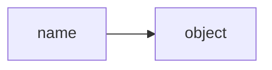

# Mental Models

## Why Mental Models Matter

Mental models are frameworks for understanding how systems work. Good mental models help you:

- **Predict behavior**: Understand what code will do before running it
- **Debug effectively**: Quickly identify why code behaves unexpectedly
- **Design better**: Make choices aligned with how Python actually works
- **Learn faster**: New concepts connect to existing understanding

This document presents key mental models for thinking about Python programs.

## Everything is an Object

### The Model

In Python, **everything is an object** - including things that aren't objects in other languages:

- Numbers: `5` is an object
- Functions: `def foo(): pass` creates an object
- Classes: `class Bar: pass` creates an object
- Modules: `import math` loads an object

### Why This Matters

Objects have:

- **Identity**: Unique identifier (`id(obj)`)
- **Type**: What kind of object it is (`type(obj)`)
- **Value**: The data it holds
- **Attributes**: Data and methods accessible via dot notation

**Example:**

```python
x = 42

id(x)          # 140234567890123 (memory address)
type(x)        # <class 'int'>
x.bit_length() # 6 (method on integer objects)
```

!!! info

    Even integers have methods because they're objects.

### Practical Impact

**Functions are first-class objects:**

```python
def greet(name):
    return f"Hello, {name}"

say_hi = greet         # Assign function to variable
print(say_hi("Alice")) # Call it through the new name

def apply_twice(func, arg):
    return func(func(arg))

apply_twice(str.upper, "hello")  # "HELLO"
```

**Classes are objects:**

```python
class Dog:
    pass

type(Dog)     # <class 'type'>
Dog.__name__  # 'Dog'

def create_class(name):
    return type(name, (), {})  # Dynamically create class

Cat = create_class('Cat')
```

## Names Are References, Not Containers

### The Model

A variable name is a **reference to an object**, not a box that contains a value. Multiple names can reference the same object. Assignment creates new references, it doesn't copy objects.

<div align="center">



</div>

### Why This Matters

**Assignment is binding:**

```python
x = [1, 2, 3]
y = x  # y references the same list as x

y.append(4)
print(x)  # [1, 2, 3, 4] - both names reference the same object
```

**Reassignment rebinds:**

```python
x = [1, 2, 3]
y = x
y = [4, 5, 6]  # y now references a different object
print(x)       # [1, 2, 3] - unchanged
```

### Implications

**Function arguments are references:**

```python
def modify_list(lst):
    lst.append(4)    # Modifies the object lst refers to

def reassign_list(lst):
    lst = [9, 9, 9]  # Just rebinds the local name

my_list = [1, 2, 3]
modify_list(my_list)
print(my_list)  # [1, 2, 3, 4]

reassign_list(my_list)
print(my_list)  # [1, 2, 3, 4] - unchanged
```

**Identity vs. Equality:**

```python
x = [1, 2, 3]
y = [1, 2, 3]

x == y   # True - same value
x is y   # False - different objects

z = x
x is z   # True - same object
```

!!! warning

    `==` compares values, `is` compares identity.

## Mutability Changes Everything

### The Model

Objects are either **mutable** (can be changed in place) or **immutable** (cannot be modified after creation).

**Mutable types:**

- `list`, `dict`, `set`
- User-defined classes (by default)
- `bytearray`

**Immutable types:**

- `int`, `float`, `bool`, `str`
- `tuple`, `frozenset`
- `bytes`

### Why This Matters

**Immutable objects can't change:**

```python
x = "hello"
x.upper()  # Returns new string, doesn't change x
print(x)   # "hello"

y = x.upper()  # Must capture the return value
print(y)       # "HELLO"
```

**Mutable objects can:**

```python
x = [1, 2, 3]
x.append(4)  # Modifies x in place
print(x)     # [1, 2, 3, 4]
```

### Implications

**Default argument trap:**

```python
def append_to(element, target=[]):  # Mutable default!
    target.append(element)
    return target

append_to(1)  # [1]
append_to(2)  # [1, 2] - same list!
```

The default `[]` is created once when the function is defined, then reused.

**Fix:**

```python
def append_to(element, target=None):
    if target is None:
        target = []  # New list each time
    target.append(element)
    return target
```

**Tuples are immutable, but can contain mutables:**

```python
t = ([1, 2], [3, 4])
t[0].append(99)  # Can modify list inside tuple
print(t)  # ([1, 2, 99], [3, 4])

t[0] = [7, 8]  # Can't reassign tuple element - TypeError
```

## Namespaces and Scope

### The Model

A **namespace** is a mapping from names to objects. Think of it as a dictionary.

**Python has several namespaces:**

- **Built-in**: Built-in functions, types, exceptions
- **Global**: Module-level names
- **Enclosing**: In nested functions
- **Local**: Function/method local variables

**LEGB Rule**: Python searches namespaces in this order:

1. **L**ocal
2. **E**nclosing function
3. **G**lobal (module)
4. **B**uilt-in

### Why This Matters

**Name resolution:**

```python
x = "global"

def outer():
    x = "enclosing"

    def inner():
        x = "local"
        print(x)  # Searches: Local → Enclosing → Global → Built-in

    inner()  # Prints "local"
    print(x) # Prints "enclosing"

outer()
print(x) # Prints "global"
```

**Reading vs. Writing:**

```python
x = 10

def read_x():
    print(x)  # Can read global x

def write_x():
    x = 20    # Creates local x, doesn't change global
    print(x)

read_x()   # 10
write_x()  # 20
print(x)   # 10 - global unchanged
```

**The `global` keyword:**

```python
x = 10

def modify_global():
    global x  # Explicitly reference global namespace
    x = 20

modify_global()
print(x)  # 20
```

### Implications

**Each module has its own global namespace:**

=== "main.py"

    ```python
    import module1
    import module2

    print(module1.x)  # 1
    print(module2.x)  # 2
    ```

=== "module1.py"

    ```python
    x = 1
    ```

=== "module2.py"

    ```python
    x = 2
    ```

**Class namespace:**

```python
class MyClass:
    class_var = 10  # Class namespace

    def __init__(self):
        self.instance_var = 20  # Instance namespace
```

## Objects Have Types, Names Don't

### The Model

Types are attached to objects, not names. A name can refer to objects of any type. This is **dynamic typing**: types are checked at runtime, not compile time.

```python
x = 42        # x refers to an int
x = "hello"   # x now refers to a str
x = [1, 2, 3] # x now refers to a list
```

### Why This Matters

**Flexibility:**

```python
# The function doesn't declare types
# You discover type issues when the code runs
def process(data):
    return data.upper()

process("hello")  # Works with strings
process(123)      # AttributeError at runtime
```

**Duck typing:**

```python
def make_sound(animal):
    animal.speak()  # Don't care what type, only that it has speak()

class Dog:
    def speak(self):
        print("Woof")

class Cat:
    def speak(self):
        print("Meow")

make_sound(Dog())  # Works
make_sound(Cat())  # Works
# If it walks like a duck and quacks like a duck, it's a duck.
```

### Type Hints

Modern Python supports optional type annotations:

```python
def greet(name: str) -> str:
    return f"Hello, {name}"
```

These are **hints**, not enforcement. They:

- Document intent
- Enable static analysis (mypy, pyright)
- Don't affect runtime behavior

## Iteration is Protocol-Based

### The Model

Any object that implements the **iteration protocol** can be iterated:

```python
for item in container:
    process(item)
```

The protocol:

1. Object has `__iter__()` that returns an iterator
2. Iterator has `__next__()` that returns next item or raises `StopIteration`

### Why This Matters

**Many types are iterable:**

```python
for char in "hello":     # Strings
    print(char)

for num in [1, 2, 3]:    # Lists
    print(num)

for key in {'a': 1}:     # Dicts
    print(key)

for line in open('file.txt'):  # Files
    print(line)
```

**You can create iterables:**

=== "main.py"

    ```python
    from countdown import Countdown

    for num in Countdown(3):
        print(num)  # 3, 2, 1
    ```

=== "countdown.py"

    ```python
    class Countdown:
        def __init__(self, start):
            self.current = start

        def __iter__(self):
            return self

        def __next__(self):
            if self.current <= 0:
                raise StopIteration
            self.current -= 1
            return self.current + 1
    ```

**Generators are iterators:**

=== "main.py"

    ```python
    from countdown import countdown

    for num in countdown(3):
        print(num)  # 3, 2, 1
    ```

=== "countdown.py"

    ```python
    def countdown(n):
        while n > 0:
            yield n
            n -= 1
    ```

## Exceptions are for Flow Control

### The Model

Python uses exceptions not just for errors, but as a control flow mechanism. This is embodied in **EAFP**: _Easier to Ask for Forgiveness than Permission._

### Why This Matters

**EAFP vs. LBYL:**

=== "LBYL (Not Pythonic)"

    ```python
    if 'key' in my_dict:
        value = my_dict['key']
    else:
        value = None
    ```

=== "EAFP (Pythonic)"

    ```python
    try:
        value = my_dict['key']
    except KeyError:
        value = None
    ```

!!! info

    EAFP assumes success and handles failures, rather than checking first.

**Benefits:**

- **Race conditions**: Checking then acting can fail if state changes between check and action
- **Performance**: One operation instead of two when success is common
- **Clarity**: Express the normal path directly

**Iteration uses exceptions internally:**

```python
iterator = iter([1, 2, 3])
while True:
    try:
        item = next(iterator)
        print(item)
    except StopIteration:
        break
```

## Code is Data

### The Model

Python code itself can be treated as data - inspected, modified, and generated at runtime.

### Why This Matters

**Introspection:**

```python
def my_function():
    """A function that does something."""
    pass

my_function.__name__     # 'my_function'
my_function.__doc__      # 'A function that does something.'
```

**Dynamic execution:**

```python
code = "x = 10\nprint(x)"
exec(code)  # Executes the string as Python code
```

**Decorators modify functions:**

=== "main.py"

    ```python
    from log import log_calls

    # The decorator receives the function as an object and returns a modified version
    @log_calls
    def greet(name):
        return f"Hello, {name}"

    greet("Alice")  # Prints "Calling greet", then returns "Hello, Alice"
    ```

=== "log.py"

    ```python
    def log_calls(func):
        def wrapper(*args, **kwargs):
            print(f"Calling {func.__name__}")
            return func(*args, **kwargs)
        return wrapper
    ```

## Summary

These mental models form a coherent way of thinking about Python:

1. **Everything is an object** - uniform treatment of all values
2. **Names are references** - understand aliasing and sharing
3. **Mutability matters** - predict whether operations modify or create
4. **Namespaces organize names** - understand variable resolution
5. **Types belong to objects** - embrace dynamic typing and duck typing
6. **Iteration is protocol-based** - recognize and create iterables
7. **Exceptions for flow** - write EAFP-style code
8. **Code is data** - leverage Python's introspective capabilities

With these models, you can:

- Read code and predict its behavior accurately
- Debug by understanding what's actually happening
- Write code that works with Python's design, not against it
- Learn advanced features more easily

## Next Steps

- Apply these models while learning [Fundamentals](../fundamentals/)
- See them in action in [Core Concepts](../core_concepts/)
- Use them to evaluate patterns in [Patterns and Practices](../patterns_and_practices/)
